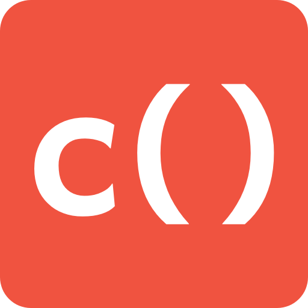

# Laravel Collection Playground

<p align="center">
    
</p>

[Laravel's collections](https://laravel.com/docs/5.8/collections) are awesome!  
This project provides a "jsfiddle" style environment to test, run & share collection code.

### It runs in the browser? :astonished:
The playground uses [pib](https://github.com/oraoto/pib) to evaluate PHP code directly inside the browser.  
When you load the playground, Vue downloads a compiled web assembly build of PHP. This is used by they playground to
locally eval your code as you type.

The disadvantages of this approach are the limited browser support - for it to work you need to be running a desktop
version of Chrome or Firefox that is recent. Safari & Edge aren't support at the moment.
See [this issue](https://github.com/atymic/laravel-collection-playground/issues/2) for more information.

### It works without internet? :mobile_phone_off:
The playground is built as a PWA, which provides several advantages. 

- Caching of downloaded PHP binary (no need to re-download the binary on each page load)
- Support for using offline (since the code is eval'd locally, it will work without any internet)

## Project Details

### Folder Structure
 - `api` contains the lambda function that is used to save playground as github gists, so they can be saved & shared. 
 - `php-app` contain a small PHP application that is used to evaluate the collection code, catch errors and return it 
 back to the client as json.
 - `php-src` contains the scripts to build the in web assembly build, containing PHP + the `php-app` code.
 - `playground` contains the Vue application which communicates with PHP to run your code, and display the results

### Building
#### PHP
```bash
php php-app/create-phar.php php-src/app.phar # create the phar containing the PHP code
cd php-src # Swtich to the pib dir
docker run --rm -v $(pwd):/src trzeci/emscripten:sdk-incoming-64bit bash build.sh # Build PHP
cp php-7.3.6/php.wasm php-7.3.6/php.js php-7.3.6/php.data ../playground/public # Copy the compiled files into the playground
```

#### Playground
```bash
cd playground
yarn # Install deps
yarn serve # Development
yarn build # Production build to `dist` folder
```

## Contributing
PRs are welcome! Feel free to improve the documentation, fix bugs and help make the playground better!
Issues are welcome as well if you find a bug or improvement.

## Further Reading
The [Laravel Collections](https://laravel.com/docs/5.8/collections) documentation.

Adam Wathan has a great course, [Refactoring to Collections](https://adamwathan.me/refactoring-to-collections/) 
which provides tons of content on refactoring your Laravel to take advantage of collections.

## Credits
The in-browser PHP evaluation uses [PHP in Browser](https://github.com/oraoto/pib) by oraoto
